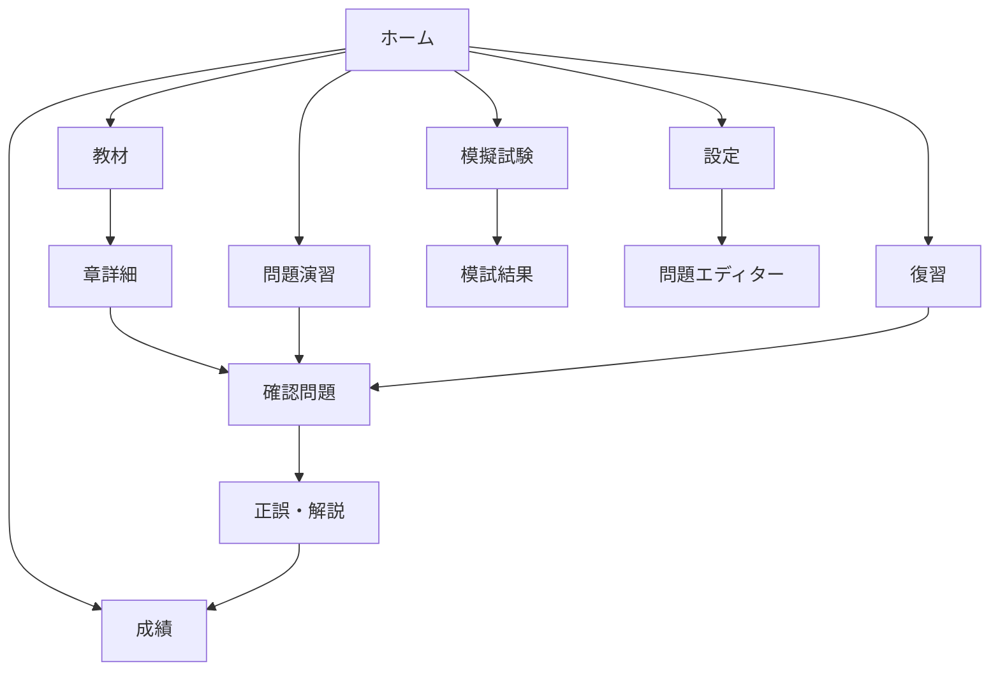
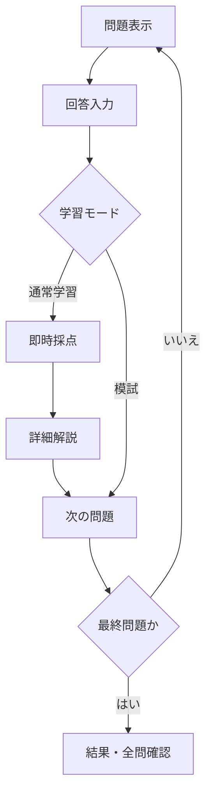

# エコトレ 完成版 v1.0.0 画面設計

作成日: 2026-07-19

完成版では、100問・90分模試、10問／30問／苦手／時事模試、問題エディター、CSV管理、PWAホーム画面追加を実装する。右上にバージョンを常時表示する。

## 1. 画面構成

## 2. モバイル共通レイアウト

| 領域 | 内容 |
|---|---|
| 上部 | ロゴ、全520問表示、バージョン、設定ボタン |
| 本文 | 選択中の画面。カードを縦方向に配置 |
| 下部固定 | ホーム、教材、演習、復習、成績 |

主要ボタンは親指で押しやすい高さ52px以上を基本とする。正誤は緑・赤だけで示さず、チェック・×記号と文言を併用する。

## 3. ホーム

1. 今日の問題カード
   - 「今日の10問」を大きく表示
   - 復習待ち件数を案内
   - 開始ボタン
2. 学習状況
   - 総合正答率
   - 累計解答数
   - 連続学習日数
3. 学習メニュー
   - 教材
   - 問題演習
   - 10問ミニ模試
   - 復習
4. 学習分析メッセージ
   - 苦手分野
   - 次に取り組む内容
5. 非公式サービスの表示

## 4. 教材

- 10章をカードで表示する。
- 各カードに章番号、アイコン、キーワード、正答率を表示する。
- 章を選ぶと、要点、重要用語、試作版3問の一覧を表示する。
- 「確認問題3問を始める」から通常学習へ移動する。

## 5. 問題演習

- 出題分野を選択する。
- 問題数を選択する。
- 「1問ごとに解説」または「最後にまとめて採点」を選択する。
- 開始前に選択内容を要約表示する。

## 6. 問題回答

問題画面には、章、難易度、問題ID、進捗バーを表示する。次問へ移動すると回答UIを新しい問題用に初期化する。

## 7. 解説

- 正誤と正答
- 問題全体の解説
- 各選択肢の解説
- 覚え方
- 関連用語
- 出典、確認日、更新日
- 要復習登録
- 誤り報告

## 8. 復習

- 今日の復習
- 間違えた問題
- 手動で要復習にした問題
- 問題ID、分野、過去の正解数・解答数

## 9. 成績

- 総合正答率を円形表示
- 分野別正答率を横棒表示
- 現在の連続学習、最長連続学習、累計学習日数

## 10. 設定

- 今日の問題数
- 学習履歴の書き出し
- 学習履歴の読み込み
- 全履歴リセット
- バージョン、データ保存方針

## 11. デスクトップ

- 下部ナビゲーションを左側の縦ナビゲーションへ切り替える。
- ホームの学習メニューや教材カードを2列表示する。
- 問題本文は読みやすさを優先し、最大幅820px程度に制限する。
